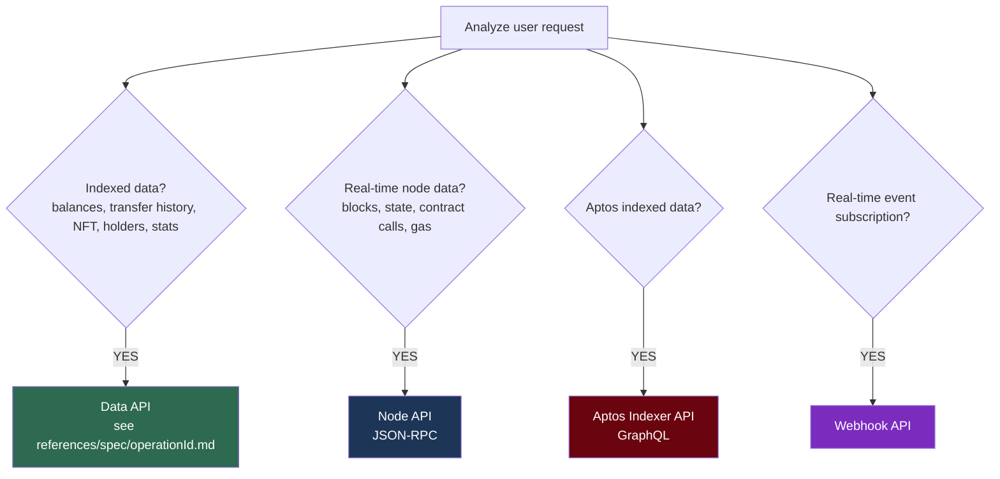

# Web3 Tools

A skill for querying and utilizing multi-chain blockchain data through the Nodit Blockchain Context.

## When to Use

- Wallet balance / token / NFT queries
- Transaction lookup / tracking / analysis
- Block data queries
- Reading smart contract state
- ENS name resolution
- On-chain event monitoring (Webhook)
- Gas fee / transaction fee checks
- Token holder / transfer history analysis
- For x402 USDC payments (no API key), see the `web3-x402` skill

## Constraints

- Do not give investment advice or speculate on token value
- Show balances as raw values + decimals as-is (use tools for unit conversion)
- Use only on-chain data verifiable through Nodit
- Prefix responses with "According to the Nodit Blockchain Context," once
- Ask the user if required context (address, chain, time range, etc.) is missing
- Official docs: `https://developer.nodit.io/reference/{operationId}`

## API Selection Guide

**Prefer Data API over Node API** — faster and more efficient with optimized indexed data.

## How to Use

### Step 1: Identify the chain / network

Read `references/supported-chains.md` to check which APIs and networks are supported for the target chain.

### Step 2: Find the appropriate operationId

Read `references/quick-reference.md` to find the operationId and supported chains for your task.

### Step 3: Verify the spec via reference file

Read `references/spec/{operationId}.md` to verify exact parameters, request format, and response schema.
For Aptos Indexer, refer to `references/spec/aptos-indexer-{queryRoot}.md`.

### Step 4: Call the API

Read `references/how-to-call-api.md` to check the Base URL, authentication, and request format for the API type, then make the call.
