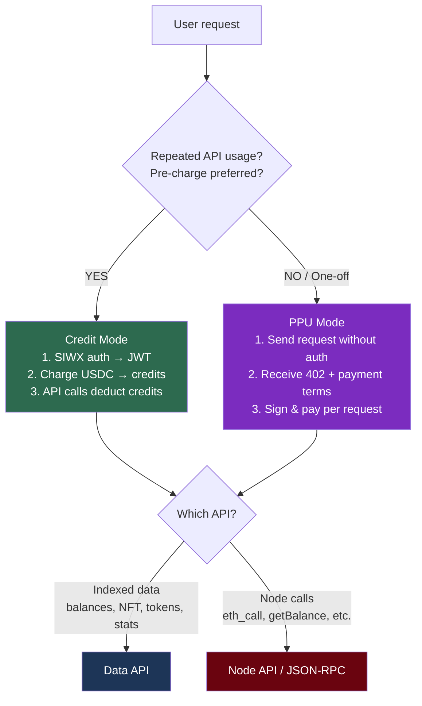

# Web3 x402

An alternative authentication and billing layer for the `web3-tools` skill. If you have an `X-API-KEY`, the `web3-tools` skill alone is sufficient. If you don't (e.g., autonomous agents), use this skill alongside `web3-tools` — this skill handles wallet-based auth and USDC payments, while `web3-tools` provides the API specs and parameters.

## When to Use

- Calling Nodit APIs without an API key (wallet + USDC only)
- SIWX authentication (SIWE for EVM, SIWS for Solana)
- Credit mode: pre-charge USDC → off-chain credit deduction per request
- PPU mode: per-request on-chain USDC settlement
- Checking credit balance or transaction history
- Understanding x402 pricing per API operation

## When NOT to Use

- Querying blockchain data with a traditional API key → use `web3-tools` skill instead
- Investment advice or token value speculation

## Constraints

- Do not give investment advice or speculate on token value
- Use only data verifiable through the Nodit x402 proxy
- Prefix responses with "According to the Nodit x402 Proxy," once
- Ask the user if required context (address, chain, mode, etc.) is missing

## Mode Selection Guide

## How to Use

### Step 1: Overview — Endpoints, URL patterns, 402 structure

Read `references/how-to-use.md`. It contains the Base URL, endpoint table, URL patterns, 402 response structure, payment-signature format, and business rules shared across all modes.

### Step 2: Mode-specific implementation guide

Read only the document for the relevant mode:

- **Credit mode** → `references/credit-mode.md` — Full flow and code covering SIWX authentication (JWT issuance), credit charging, balance checking, and API calls
- **PPU mode** → `references/ppu-mode.md` — Full flow and code covering receiving a 402 without authentication → generating a payment-signature → re-requesting

### Step 3: Check supported chains

Read `references/supported-chains.md` to verify which chains and networks are available.

### Step 4: Check pricing

Read `references/pricing-data-api.md` or `references/pricing-node-api.md` to find the credit cost and PPU price for the target operation.

### Step 5: Look up the API spec

For request parameters and response schemas, refer to the `web3-tools` skill — the underlying APIs are the same. Use `web3-tools/references/quick-reference.md` to find the operationId, then read `web3-tools/references/spec/{operationId}.md` for the full spec.
